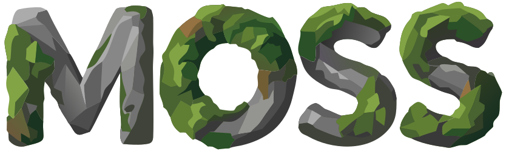

<div align = "center">


# The Moss Programming Language

*meta-language to create DSL front-end*

   

</div>

## Why moss
Most DSL (domain specific language) like [nvidia-warp](https://nvidia.github.io/warp/), [tile-lang](https://github.com/tile-ai/tilelang), use Python as front-end. However, Python as DSL front-end suffers from:

- **raw source code extraction and re-parsing**: which makes the function feature in python use-less.
- **ordinary diagnostic ability**: while DSL can have very arbitary diagnostic need like dependant-type checking. 

Moss-lang aims to be a meta-language to create DSL front-end with very advanced features, providing easy integration for JIT/AOT backend.

## Features
- **language-server is interpreter, diagnostic is error value**
  
    as long as you want language-server to report an error, just return an error value.
- **pure DAG (acyclic dependency graph) form**
    
    backend directly get a DAG with fully resolved symbols.
- **first-class function, closure, higher-order function**

    wich can create function template easily.
- **parallel diagnosing/interpreting in mutual-recursive module level**

    module is just a parallel hint, no cyclic dependency hell.
- **fine‑grained field dependency tracking**

    depending a field of a struct is not depending on the whole struct.

## Start Developing
0. setup [Rust](https://rust-lang.org/learn/get-started/) developing environment, download [Zed](https://zed.dev/) and have it in PATH, have [Python]() in PATH.
1. clone this repo.

    ```
    git clone https://github.com/windwhiterain/moss-lang --recursive
    ```
2. debug build the project.
    ```
    cargo build
    ```
3. run the [install script](install.py).
    ```
    python install.py
    ```
    > you can uninstall by run it with one arbitrary argument
    > ```
    > python install.py u
    > ```
    try run `moss` in any terminal to check if installed successfully.
    ```
    moss
    ```
    got:
    ```
    Moss Lang v0.1.0
    ```
4. run Zed from terminal.
    ```
    zed --foreground
    ```
5. install [zed extension](zed-extension) in Zed via `Extensins/Install Dev Extension`.
6. restart Zed, open [example Moss project](language_example/_), diagnostics and inlay-hint should appear. 
7. open more project inside [example Moss projects](language_example), note that a moss project is a folder with a `src` sub-folder.
